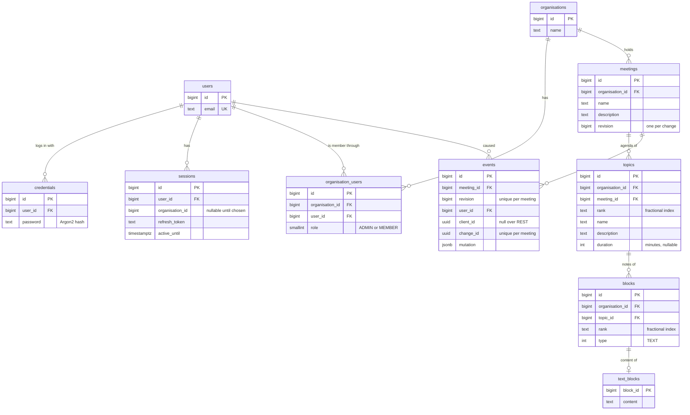

Notula
=

Notula is a web application for running meetings that actually get somewhere.

Instead of one person typing minutes into a document and mailing them around
afterwards, everyone in the meeting works in the same live agenda. You prepare
the topics up front, give each one a time budget, and take notes underneath it
while the meeting is happening. Every change is shared with the other
participants in real time, so the notes are already finished when the meeting
ends.

Notula is multi-tenant: users belong to one or more organisations, and all
meetings, agendas and notes live inside an organisation.

Where the project is heading is described in [doc/ROADMAP.md](doc/ROADMAP.md).
The design is in [doc/](doc/): [PRODUCT.md](doc/PRODUCT.md) for the domain and
its constraints, [WEBSOCKETS.md](doc/WEBSOCKETS.md) for the live protocol, and
[SEQUENCING.md](doc/SEQUENCING.md) for ordering, versioning and conflict
handling.

Features
==

- **Organisations** — group users in an organisation; members are either
  `ADMIN` or `MEMBER`. Users pick (or switch) the organisation they are working
  in, and a session is scoped to that organisation.
- **Meetings** — create meetings with a name and description, list them and
  delete them.
- **Agenda** — a meeting holds an ordered list of topics. Each topic has a
  name, a description and an optional duration, so the agenda doubles as a time
  budget for the meeting.
- **Notes** — every topic contains an ordered list of blocks holding the notes
  taken for that topic. Text blocks are supported today; the block model is
  built to be extended with other block types.
- **Real-time collaboration** — meetings, agendas and notes are edited over a
  WebSocket connection. Edits are sent as incremental text updates
  (position/length/value) rather than whole documents, and are broadcast to
  everyone subscribed to the meeting. Two people typing into the same text at
  once converge: each edit carries the revision it was written against and is
  rebased over what happened since. A client that misses a change asks for it
  again rather than drifting.
- **Accounts and sessions** — registration with email and password, JWT access
  tokens with a refresh token in an HTTP-only cookie.
- **Internationalisation** — all UI text goes through translation files
  (English is included).

Architecture
==

Notula is split into two applications plus a local nginx that terminates TLS
and puts both behind one origin.

Backend (`backend/`)
===

Java 25 / Spring Boot 4 application, built with Maven.

- REST API under `/api/*` for the request/response parts: `users`, `sessions`,
  `organisations`, `organisation-users` and `meetings`.
- STOMP over WebSocket on `/ws` for everything that happens inside a meeting.
  Every change, whatever it is about, is sent to one destination,
  `/app/meetings/{meetingId}/changes`, as one JSON envelope keyed on `type`.
  Clients subscribe to `/topic/meetings/{meetingId}` for the resulting events,
  to `/app/meetings/{meetingId}` for the current state, and to
  `/app/meetings/{meetingId}/events/{after}` for the events after a revision.
  The sender alone hears back on `/user/queue/acks` or
  `/user/queue/rejections`. [doc/WEBSOCKETS.md](doc/WEBSOCKETS.md) has the
  details.
- Changes to one meeting are applied one at a time under a per-meeting lock,
  each bumping the meeting's revision, and every resulting event is logged in
  the same transaction and broadcast after it commits.
- PostgreSQL for persistence, with a single Flyway migration,
  `src/main/resources/db/migration/V1__init.sql`, which is edited in place
  until something is deployed.
- Layering is explicit and consistent: controllers/websockets → `*Service` →
  `*StorageGateway` → Spring Data repository, with separate DTO (transport),
  BDO (domain) and DAO (JPA entity) types per package.
- Spring Security guards both the REST API and the WebSocket channel; every
  operation is checked against the organisation the session is scoped to.
- Tests run against a real PostgreSQL through Testcontainers (Docker required),
  with JaCoCo coverage and PIT mutation testing configured.

Frontend (`frontend/`)
===

SvelteKit 2 / Svelte 5 application in TypeScript, built with Vite.

- Route groups mirror the access model: `(public)` for login and registration,
  `(unscoped)` for picking an organisation, `(scoped)` for everything inside an
  organisation and `(scoped)/(admin)` for organisation administration.
- `src/lib/<domain>/` holds the API clients, WebSocket clients and views per
  domain (meeting, topic, block, textblock, organisation, user, session).
- `@stomp/stompjs` for the live meeting connection, `sveltekit-i18n` for
  translations.

Data model
==

The schema in `V1__init.sql`. Every key is a server-assigned `BIGINT`;
every delete cascades down the tree.



- Every row below the organisation carries `organisation_id`, so
  authorisation is a direct check. `events` does not: it is only read by
  meeting, inside a change or replay already authorised.
- `rank` is a base-62 fractional index, compared as text; siblings sort by
  `(rank, id)`. A move writes one row.
- `events` is the log of everything broadcast for a meeting, with the
  `MutationDto` the clients received as `JSONB`. It is what text edits are
  rebased against, what a client that missed something is replayed from, and
  where a change sent twice is recognised by its `change_id`.

Running locally
==

Prerequisites: JDK 25 or 26 (not 27: Lombok's annotation processor fails to
start under it), Node.js, Docker (for PostgreSQL, nginx and the backend
integration tests). With several JDKs installed, point `JAVA_HOME` at one, e.g.
`JAVA_HOME=$(/usr/libexec/java_home -v 26) ./mvnw …` on macOS.

1. Start PostgreSQL and create a `notula` database. The defaults the backend
   expects are in `backend/src/main/resources/application.properties`
   (`localhost:5432`, user and password `postgres`). Flyway creates the schema
   on startup.
2. Backend (listens on port 7000):
   ```
   cd backend
   ./mvnw spring-boot:run
   ```
   Tests: `./mvnw clean test`, or `./mvnw clean verify` for the JaCoCo report
3. Frontend (Vite dev server on port 5173):
   ```
   cd frontend
   npm install
   npm run dev
   ```
   Tests: `npm test` — types: `npm run check` — formatting: `npm run format` /
   `npm run lint`
4. Start the nginx container described under [Setup](#setup) and open
   <https://localhost:4443>.

The frontend talks to `https://localhost:4443/api` and
`wss://localhost:4443/ws` (see `frontend/.env`), so nginx needs to be running
even for local development — that is what the certificate setup below is for.

Setup
==

The first steps have already been done, and you can skip to Adding the authority to the browser, and using it in nginx.
If you ever need to do the entire setup yourself, this are the steps:

Create local Certificate Authority:
```
openssl genrsa -out localCA.key 4096
openssl req -x509 -new -nodes -key localCA.key \
  -sha256 -days 3650 \
  -subj "/CN=Local Dev CA" \
  -out localCA.pem
```

Trust the Certificate Authority:
```
sudo cp localCA.pem /usr/local/share/ca-certificates/local-dev-ca.crt
sudo update-ca-certificates
```

Generate keys:
```
openssl genrsa -out localhost.key 2048

openssl req -new -key localhost.key \
  -out localhost.csr \
  -config localhost.cnf

openssl x509 -req \
  -in localhost.csr \
  -CA localCA.pem \
  -CAkey localCA.key \
  -CAcreateserial \
  -out localhost.crt \
  -days 825 \
  -sha256 \
  -extensions req_ext \
  -extfile localhost.cnf
```

Add authority to browser (Firefox):
```
Settings → Privacy & Security
Certificates → View Certificates
Authorities → Import → localCA.pem
```

Using in nginx:
```
docker run --name notula-nginx \
	-v ./nginx.conf:/etc/nginx/nginx.conf:ro \
	-v ./ssl:/etc/nginx/certs:ro \
	-p 4443:443 \
	-d nginx
```

Note: currently you still may have to update the ip addres the host.docker.internal binds to.
Note: on Linux, add the host mapping: `--add-host=host.docker.internal:host-gateway`

Notes
==

I have decided to (temporarly) abandon this project. The main reason is that it seems to have gotten away from me.
I had some idea/design in my head, but it didn't work out, and as I used more and more AI, it grew in complexity to the point where I no longer see a clear design.
This is not the fault of AI, every step, every small piece of added complexity made sense, and I approved id and agreed with it.

The main cause of the complexity is the combination of websockets and structured data.
I underestimated the complexity of websockets and real-time collaboration.
This complexity it managable when your data structure is simple, like Google Docs.

If you combine this with structured data, you end up with ugly mixed up complexity.
For example: the revision on the meeting with all the changes causing to revert to the previous version, but changes may be irrelevant.

It was a valuable lesson, and I did learn a lot.
If I would do it again, I would do it differently.
First of all, do we really need the real-time collaboration? Maybe not!
Instead of the real-time submission of events, I would do it with an actual trigger (save button)
Note: this is for instance how Jira and Confluence do it.
By doing this, you don't even need websockets for the submission of data.
History is no longer needed to handle conflicts, and just becomes a feature to be added if wanted.
The history can then become more specific (on the topic or block)
Version for the entire meeting is no longer required.
But you may want to have a system to lock a part while editing (or use versions to signal conflicts).

In the end, all of this would allow the application to become a more basic REST application.
Websockets can still be used, but would only be used to send updated (just the subscription) or just signal a new version.
