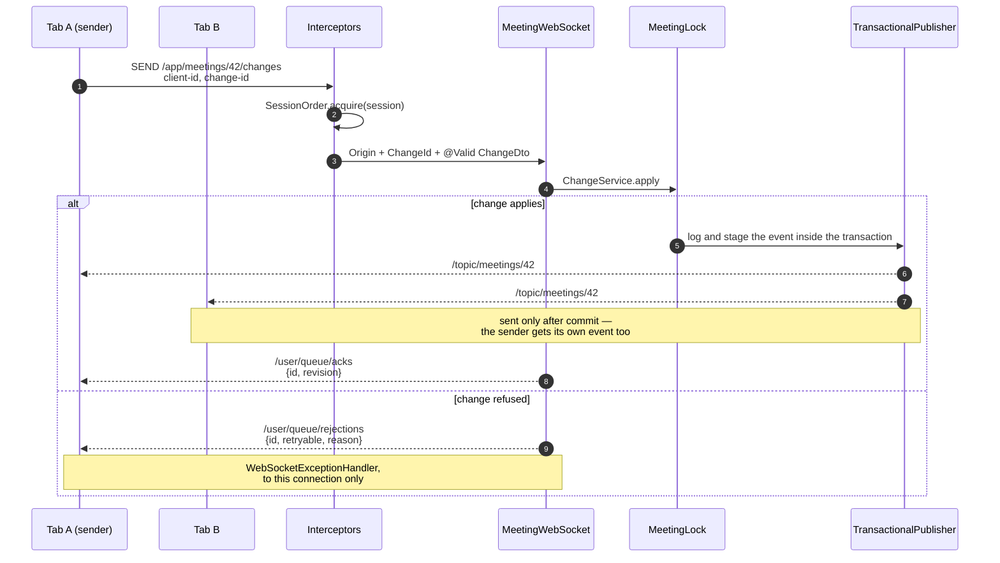
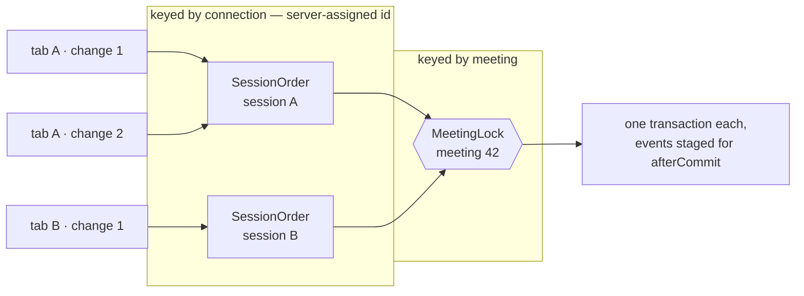

Realtime protocol
=

How a meeting stays in sync across tabs: one STOMP connection, one destination
for every change, and five identifiers with five different lifetimes.

`SEQUENCING.md` is the plan for making concurrent editing correct. This document
is the description of what the transport does today: what is on the wire, what
each identifier means, and which of them are actually load-bearing.

The connection
==

One WebSocket per browser tab, carrying STOMP, opened against `/ws` and
restricted to the frontend origin. A tab does not open a connection per meeting;
it opens one and subscribes to what it currently needs.

Authentication happens once, on the `CONNECT` frame.
`config/WebSocketChannelInterceptor` decodes the bearer JWT, converts it into a
`Principal`, attaches it to the session, and stores the token's expiry in the
session attributes for later. Every frame after that is already authenticated,
because the STOMP session carries the user.

Six destinations:

- `/app/meetings/{id}` — subscribing here returns the meeting snapshot, once, to
  the subscriber alone. A `@SubscribeMapping` reply, not a broadcast.
- `/app/meetings/{id}/events/{after}` — subscribing here returns, once, the
  logged events after revision `after`, in order — the same events the topic
  carried. The client asks for it on a gap, rather than reloading the
  meeting.
- `/app/meetings/{id}/changes` — the single destination a client sends every
  change to, whatever the change is about.
- `/topic/meetings/{id}` — every event for that meeting, to everyone subscribed,
  including whoever caused it.
- `/user/queue/rejections` — refusals, to the one connection that asked. Success
  is never reported here; a change that worked arrives as an event on the topic
  like everyone else's.
- `/user/queue/acks` — `{id, revision}` for a change that committed, to the one
  connection that sent it: the return value of the handler, so it cannot be
  sent for a change that threw.

Inbound frames are handled on a dedicated pool (`ws-inbound-`, sized to the core
count) so a slow change cannot stall the broker, with heartbeats every 10s in
both directions on a two-thread scheduler.

The five identifiers
==

Most of the confusion here comes from the word "session", which names three
unrelated things, and from two client-minted UUIDs that look interchangeable but
are not. The honest way to tell them apart is not what they identify but **how
long they live**.

**Bearer JWT** — minted by the auth server, refreshed 60s before expiry. Rides
the `Authorization` native header on `CONNECT` only. Read by
`WebSocketChannelInterceptor`. *Load-bearing.*

**`userId`** — decoded from the JWT into `Principal`. Server-side, and echoed to
clients in `origin.userId`. Read by authorisation in every service.
*Load-bearing.*

**STOMP session id** — assigned by Spring from the underlying
`WebSocketSession`. Never sent to the client. Read by `SessionOrder` and by
`@SendToUser` routing. *Load-bearing, server only.*

**`client-id`** — minted by the browser, `crypto.randomUUID()` at module load.
Rides the `client-id` header out and comes back as `origin.clientId`. Read by
`MeetingWebSocketClient` through `isOwnEvent()`, to recognise the echo of its
own change: a text echo is dropped, because the editor already applied it.
*Load-bearing.*

**`change-id`** — minted by the browser, per change in
`MeetingWebSocketClient.send`. Rides the `change-id` header out and comes back
as the acknowledgement's `id` or `RejectedDto.id`. Read by the client to match
an acknowledgement to the change in flight before releasing the next one, and
recorded by the server on the change's event, so a change sent again under the
same id is acknowledged at its logged revision rather than applied twice.
*Load-bearing.*

Their lifetimes, against the events that end them. The span is one access
token: issued for 30 minutes, refreshed 60s before it expires.

```mermaid
gantt
    title Identifier lifetimes across one tab
    dateFormat HH:mm
    axisFormat %H:%M
    todayMarker off

    section userId
    outlives the page — from the JWT   :done,   uid,  08:55, 10:10

    section client-id
    the tab — survives the reconnect   :active, cid,  09:00, 10:05

    section STOMP session id
    connection A                       :        sida, 09:00, 09:29
    connection B — new id              :        sidb, 09:29, 10:05

    section change-id
    one change, until answered         :crit,   chg,  09:12, 09:13

    section events
    page load                          :milestone, m1, 09:00, 0m
    change sent                        :milestone, m2, 09:12, 0m
    token refresh                      :milestone, m3, 09:29, 0m
    tab closed                         :milestone, m4, 10:05, 0m
```



A token refresh tears down the connection and builds a new one, so the STOMP
session id changes underneath a tab that never went away. Anything that must
mean *this tab* across that break cannot be the session id. That is the whole
reason `client-id` exists alongside it.

Three things called "session"
--

- `Session.#SESSION_ID` in the frontend is a **number**: the row in the sessions
  table, used to build `/sessions/{id}/refresh`.
- The **STOMP session id** is a server-assigned string the client never sees.
- The **session attributes** are the WebSocket handshake's attribute map, where
  the token expiry is stashed for `WebSocketSessionRegistry`.

None of these is the other. The naming is the most confusing thing in this
layer and is worth fixing before anything else here is.

Sending a change
==

A client sends everything it does to one destination, rather than a destination
per entity. The body is the change itself; the identifiers travel in headers.

```
SEND
destination:/app/meetings/42/changes
client-id:9d4e1b06-7c52-4f38-b1a9-6e83d0c5f2b7      <- the tab
change-id:7c6f0d54-2f70-4a1e-9f5a-1d4c8b2e0a11      <- this change
content-type:application/json

{"type":"ADD_TOPIC","afterId":32,"name":"Blockers"}^@
```

A text change also carries `base` in its body — `{"type":"RENAME_TOPIC",
"topic":32,"base":41,"position":4,"length":2,"value":"new"}` — the meeting
revision the tab held when the change left its queue, which its positions were
counted in. It is part of the change rather than a header because nothing but
a text edit reads it; the server does not read it yet either.

The ids are headers rather than body fields because a refusal has to name the
change even when the body is what went wrong. Read out of the body, the one case
that most needs naming — a body that cannot be parsed — is the one case that
could not have it.

What the frame passes through, in order:

1. `config/WebSocketChannelInterceptor` passes it through: it only acts on
   `CONNECT`, and this session is already authenticated.
2. `config/SessionOrderInterceptor` acquires this session's semaphore, so this
   tab's changes are applied in the order it sent them.
3. Argument resolvers build `Origin` from the principal and the `client-id`
   header, and `ChangeId` from the `change-id` header. Neither handler nor
   advice touches raw headers.
4. `@Valid` on the payload converts and validates the body into a `ChangeDto`.
   `meeting/MeetingWebSocket.submit` catches nothing.
5. `meeting/ChangeService` takes `meeting/MeetingLock` for the meeting, which
   owns the lock, the transaction and the revision, and hands back the
   `MeetingScope` — the meeting id and the revision this change commits at.
6. Inside the lock, a text change is rebased by `meeting/TextHistory` over the
   edits to the same text logged since its `base`, and every change is
   dispatched to the service that owns its rule, which writes it and publishes
   one event.
7. `event/EventService` logs the event in the same transaction, and
   `common/messaging/TransactionalPublisher` holds the broadcast until
   `afterCommit`, so nobody is told about a change that later rolled back.
8. The handler returns the acknowledgement, `{id, revision}`, to the sender.

What comes back
==

Three channels, asymmetric on purpose. Success fans out to everyone, and is
acknowledged to the sender alone; failure goes back to one connection.



Success — an event on the meeting topic
--

Every event carries an `origin`: the `userId` that caused it and the `clientId`
of the tab that did. The originating tab receives its own events like everyone
else. Events created over REST rather than the socket — `MeetingController`
builds `new Origin(principal)` — carry a null `clientId`.

One change, one event, one revision. Every event of a meeting carries the
revision its change committed at, and the client checks each against the last
it applied: a gap asks for the events after that revision and applies them
before whatever arrived meanwhile.

Acknowledgement — to the sender alone
--

`/user/queue/acks` carries the `change-id` and the revision the change
committed at. It arrives on a different subscription from the change's event,
so either can come first; the client releases its next change only when it
holds both, and stamps that change's `base` with the revision it then holds.

Failure — a rejection on the user queue
--

Nothing is caught in the controller. `common/controller/WebSocketExceptionHandler`
owns every refusal for every destination, and can name the change because a
`@MessageExceptionHandler` is offered the same resolved arguments as the method
that failed.

```
MESSAGE
destination:/user/queue/rejections
content-type:application/json

{"id":"7c6f0d54-2f70-4a1e-9f5a-1d4c8b2e0a11",
 "retryable":false,
 "reason":"It could not be found."}^@
```

`retryable` is decided by exception type, never by a catch-all:

- `MissingEntityException` — refused. *"It could not be found."*
- `BusyEntityException` — **retryable**. *"Someone else was changing it. Try
  again."* A meeting held too long by another change is the only retryable case.
- `InvalidActionException`, `IllegalArgumentException`,
  `MethodArgumentNotValidException` — refused. *"It was not valid."*
- `Exception` — refused, and logged. *"The request could not be handled."*

Deciding by type is what keeps a bug in a service from being reported to a user
as "try again", which is what a `catch (RuntimeException)` fallback did before
`BusyEntityException` existed.

`id` is null only when the client named nothing — a subscription that failed,
say. `ChangeIdArgumentResolver` deliberately never throws: a malformed
`change-id` yields `ChangeId.NONE` rather than a second failure that would bury
the first, since an exception handler that cannot resolve its own arguments is
swallowed by Spring and the client hears nothing at all.

Ordering
==

Two independent guarantees, at two scopes, answering two questions. Both are
current-state; `SEQUENCING.md` is where they are going.



Each tab's own changes are held in the order that tab sent them; tabs do not
wait on each other at the first gate, and its wait is unbounded — slowness is
the lock's to report. At the second, every tab's changes are applied one at a
time, and a change that waits longer than 10s for the meeting is refused as
retryable.


`config/SessionOrder` is keyed by the STOMP session id, which matters: that id
is assigned by the server, so one tab cannot stall another by claiming its
identity. Keying it on the client-minted `client-id` would hand every tab that
power. A turn is handed back in `afterMessageHandled`, or in
`afterSendCompletion` for a frame a later interceptor refused, at most once
per turn, and the session is forgotten on `DISCONNECT`, so a reconnect starts
clean.

`meeting/MeetingLock` owns the lock *and* the transaction together, and hands
out per-meeting locks that are dropped once nothing holds or waits for one, so
the map does not keep an entry for every meeting the instance has ever served.
The reasoning behind that coupling is in `SEQUENCING.md`, step 2.

Without the upper lane, two rapid edits from one tab could reach the lock out of
order and land reversed. Without the lower one, two tabs could interleave inside
one meeting's state.

Expiry and reconnect
==

The JWT is checked once, at `CONNECT`. Without more, a connection opened with a
valid token would outlive it indefinitely — so `config/WebSocketSessionRegistry`
schedules a close at the token's expiry, sending `POLICY_VIOLATION "Access token
expired"`.

The client gets in first. `auth/Session` schedules a refresh 60s before expiry;
on success it calls `WebSocketClient.reconnect`, which deactivates and
reactivates with the new token. If the identity changed rather than just the
token, it discards the client and builds a new one instead.

- Subscriptions are re-established on `onConnect` from a map the client keeps,
  so the tab is resubscribed without the caller doing anything.
- Sends issued while disconnected are queued and flushed on reconnect, which
  means a change can arrive on a *different* STOMP session than the one it was
  written on. Another reason nothing durable is keyed to that id.
- The `client-id` is unaffected: it is a module-level constant that outlives the
  `WebSocketClient` the refresh replaces.

Are they all required?
==

All five are load-bearing today — though of the two client-minted ones, a
plausible design keeps only one.

**Bearer JWT and `userId` — keep.** The only thing establishing who is acting.
Every authorisation check reads it, and it is echoed on every event so other
clients can attribute a change.

**STOMP session id — keep.** Two jobs nothing else can do: keying
per-connection ordering with an id the client cannot forge, and addressing a
reply to one connection rather than every tab a user has open. Never leaves the
server.

**`change-id` — keep.** The client matches an acknowledgement to the change in
flight by it, and releases nothing on an acknowledgement for another change.
None of the call sites keeps the returned id, and `onRejected` does not read
`rejected.id`: a refusal clears the queue and reloads whichever change it names.

**`client-id` — keep.** It is how a tab recognises the echo of its own change,
and text echoes must be dropped because the editor applied them already.
Creating, moving and deleting still rely on the echo to update the view, so
only text is dropped. It cannot be replaced by the session id, which changes
under a tab on every token refresh.

The one that could go
--

`client-id` and `change-id` answer questions a single identifier could answer.
If events echoed the originating `change-id` in their `origin`, a tab holding
its own outstanding change ids — which it must hold anyway, to correlate
refusals — could recognise its own events from that set. The tab identity would
fall out of the change identity, and one client-minted UUID would do both jobs.

The obstacle used to be fan-out: `REMOVE_TOPIC` emitted a `Delete` plus a `Move`
per following topic, so a change id could not be retired when its first event
arrived. Both halves of that are now gone — fractional ranks made a change
produce a single event, and `/user/queue/acks` says explicitly which change
committed and at what revision. What is left is a question of taste rather than
a missing signal: whether `client-id` keeps the coarse "was this mine" test or
`change-id` takes over both jobs.

Text is applied optimistically now, and the acknowledgement is the end-of-change
signal the choice turned on, so nothing blocks it any longer; it is a question
of taste, and both ids are cheap to carry. What is worth fixing first is the
naming.
